# INFORMACIÓN DE LA TARJETA Y VALIDACIÓN

## TITULO

VALIDACIÓN DE TARJETA DE LOS PADRES DE FAMILIA DEL CENTRO TERAPÉUTICO SOFIAS

***
## 1 ¿Cómo descargar, instalar y ejecutar la aplicación?

La [aplicación](img/logocard.jpg),lo pueden encontrar en PLAY STORE para Android o en APP STORE en Iphone.
PASOS SENCILLOS PARA ACCEDER:
 1. click en instalar
 2. Ingresa los datos personales solicitiados (Sólo para el registro)
 3. Ya lo tienes listo!!!✌

## 2. Resumen del proyecto

📲💰El proyecto TS es una aplicación que permite a los padres de familia, que reciben servicios de terapia, hacer pagos de forma online.

### 2.1 Principales usuarios

💏Son los padres de familia cuyos hijos demandan servicios de la institución TERAPIA SOFIAS.

### 2.2 Objetivo de los usuarios con relación al producto

🤸‍♀️Hacer el pago de los servicios de terapia.

### 2.3 Problema o necesidad satisfecha

👌Contar con una modalidad de pago virtual de forma rápida y segura.

### 2.4 Primer prototipo

* PLantilla 1 se solicita la información de la tarjeta

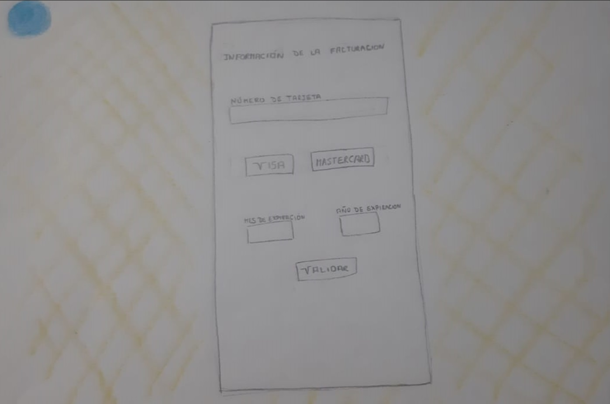

* PLantilla 2 se muestra mensaje al usuario

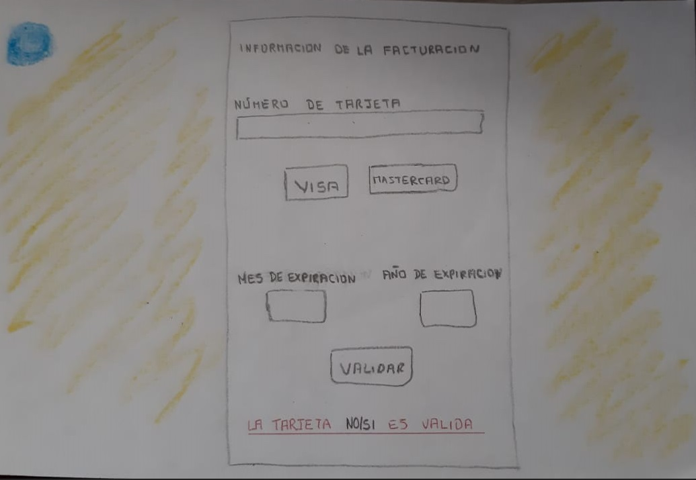

### 2.5 Resumen del feedback

A) PRIMER FEEDBACK 🐷

##* Plantilla 1:Se solicita la información de la tarjeta

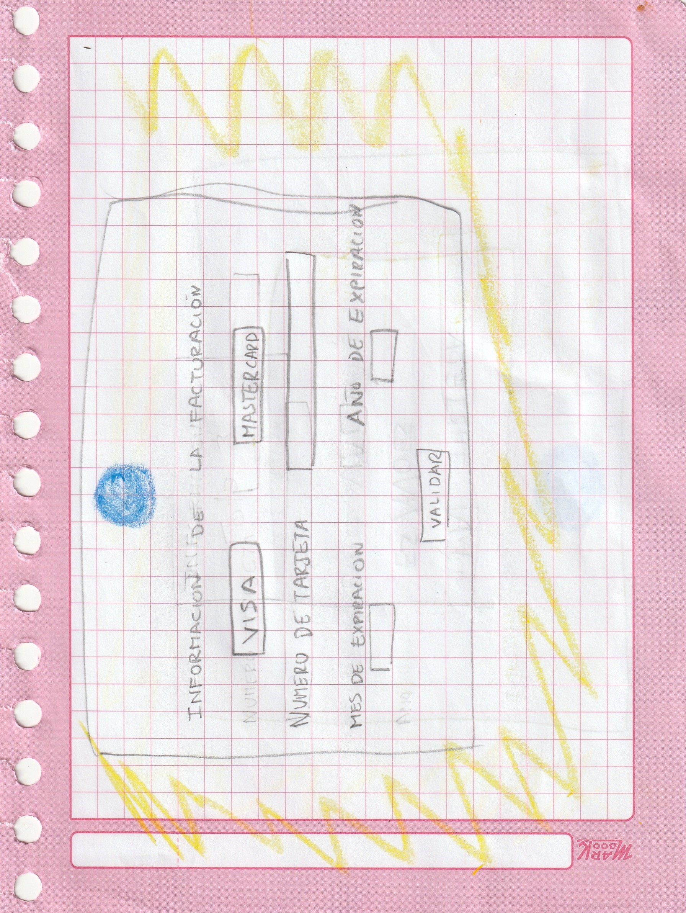

##* PLantilla 2:Se muestra mensaje con los resultados al usuario

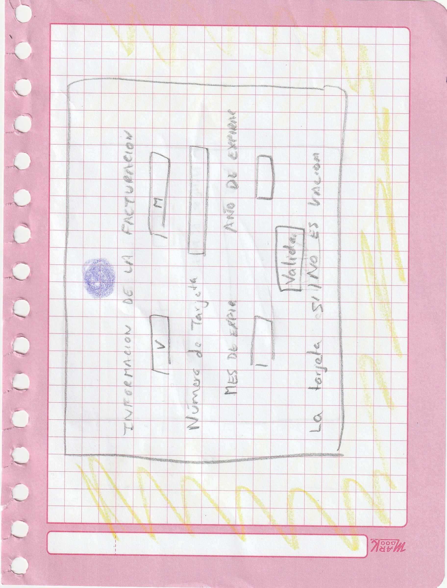

B) SEGUNDO FEEDBACK 🐵

##* PLantilla 1: se solicita la información de la tarjeta

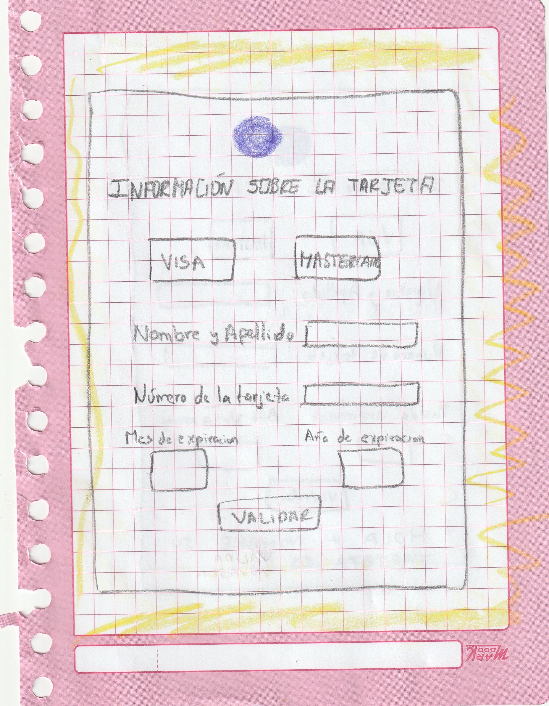

##* PLantilla 2: se muestra mensaje con los resultados al usuario

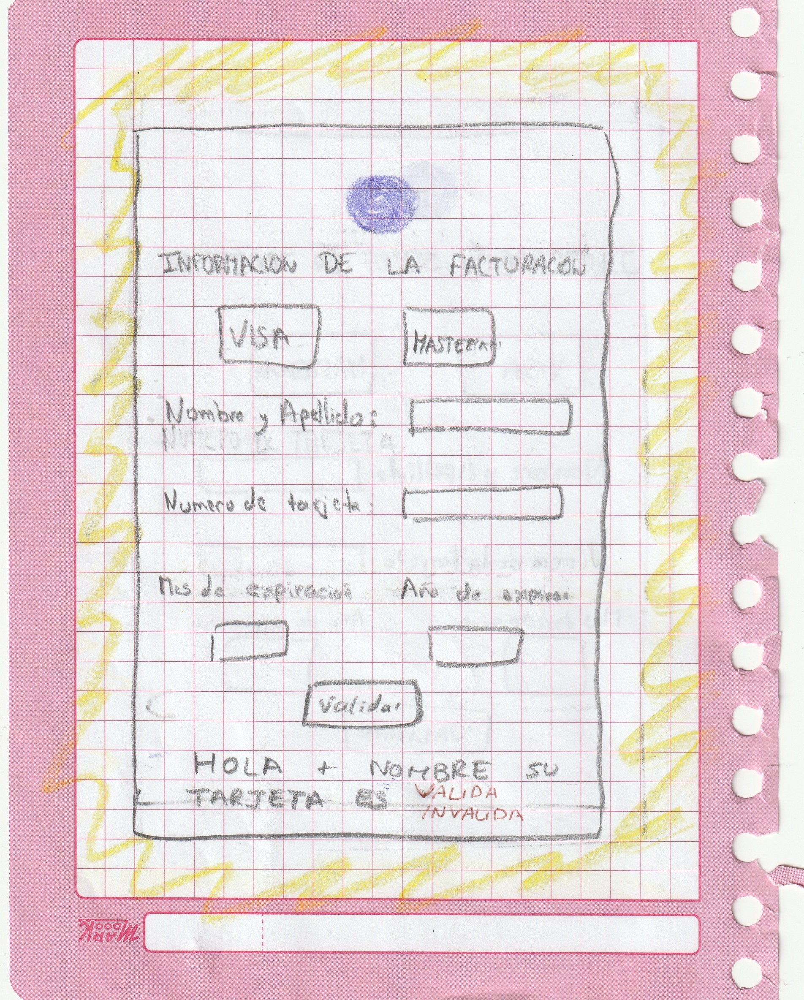

C) TERCER FEEDBACK 🦁

##* PLantilla 1 se solicita la información de la tarjeta

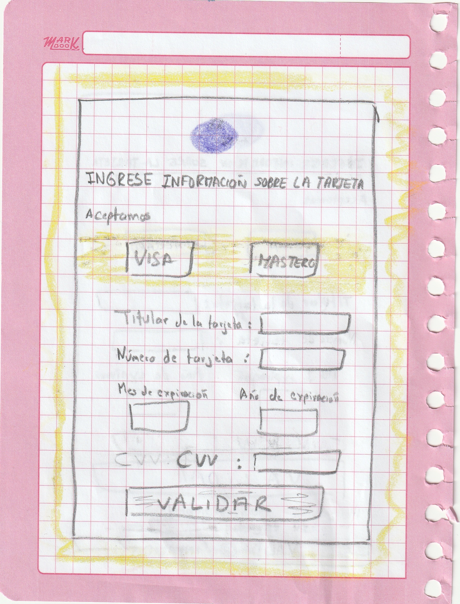

##* PLantilla 2 se muestra mensaje con los resultados al usuario

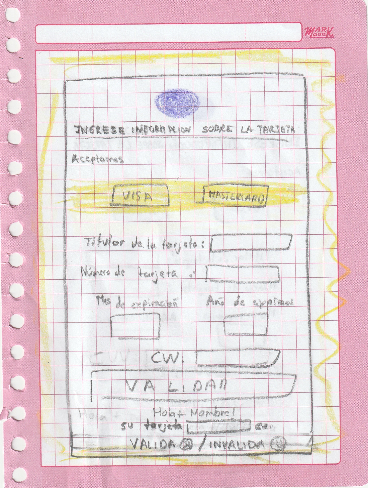

### 2.6 Imagen del prototipo final

El prototipo final desarrollado en Balsamiq

### A) Plantalla principal donde se almanenará la información de la tarjeta

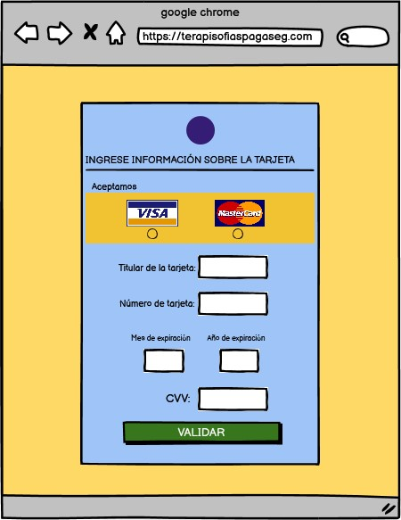

### B) Plantalla que muestra elmensaje si la tarjeta es VÁLIDA

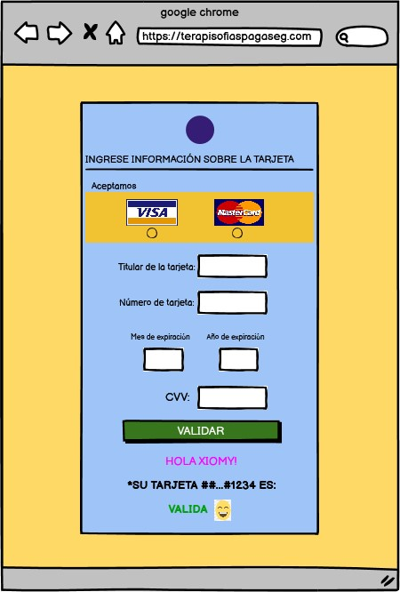

### C) Plantalla que muestra elmensaje si la tarjeta es INVÁLIDA

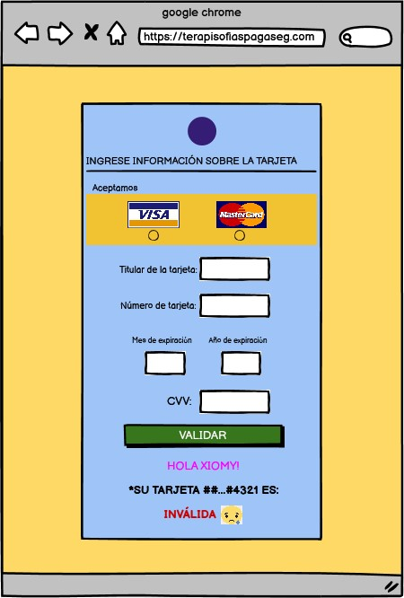

## A)Pantalla 1 - Pedir información sobre la tarjeta  

## B)Pantalla 2 - Muestra si la tarjeta ingresada es VÁLIDA

## C)Pantalla 2 - Muestra si la tarjeta ingresada es INVÁLIDA

                                                       🌻🌴🍂
## 3. Proyecto final

El proyecto final se ajustó al diseño del prototipo final

### A) Plantalla principal donde el usuario debe poner los datos de la tarjeta

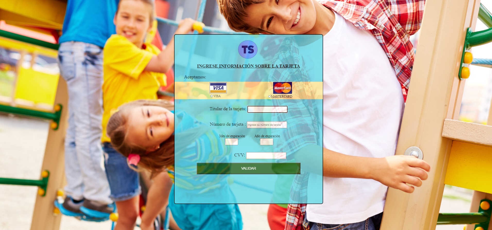

### B) Plantalla que muestra elmensaje que la tarjeta es VÁLIDA

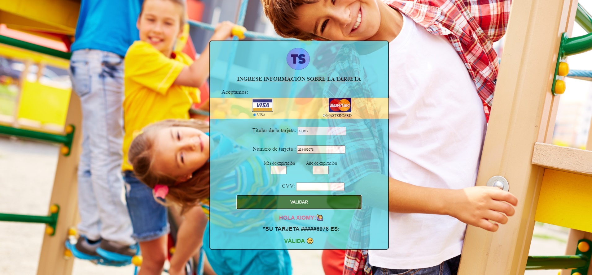

### C) Plantalla que muestra elmensaje que la tarjeta es INVÁLIDA

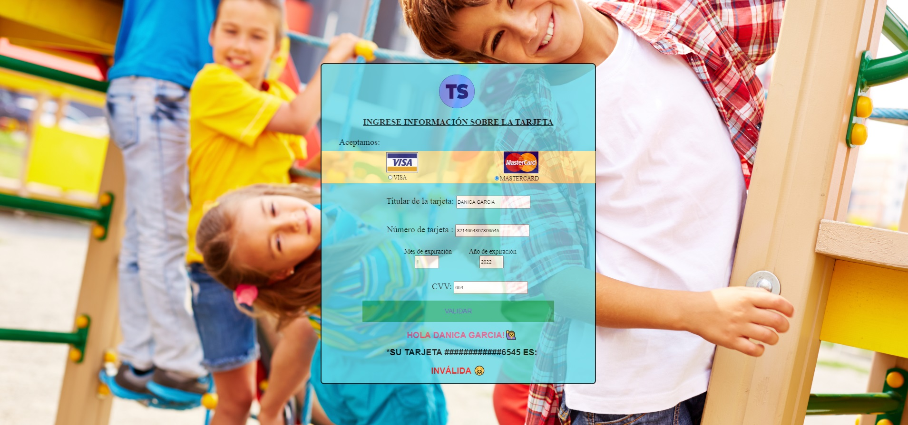
